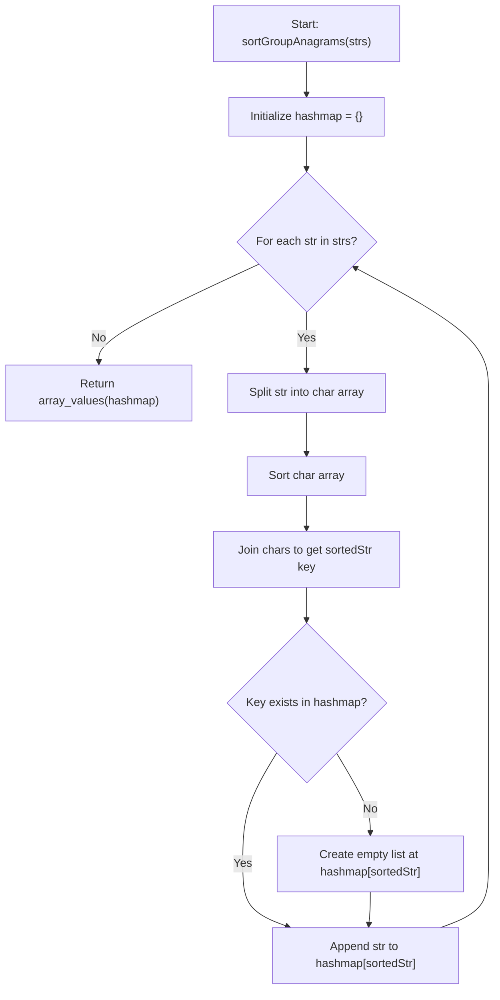
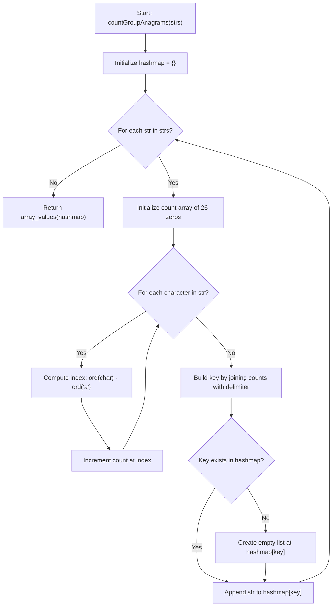

# 0049 Group Anagrams - Flowcharts and Complexities

## 1) sortGroupAnagrams(strs)

- Time complexity: `O(n * k log k)`  
  (`n` = number of strings, `k` = average string length; sorting each string dominates)
- Space complexity: `O(n * k)`  
  (hashmap keys + grouped output storage)

## 2) countGroupAnagrams(strs)

- Time complexity: `O(n * k)`  
  (counting characters is linear in each string, 26-length key creation is constant)
- Space complexity: `O(n * k)`  
  (hashmap/grouped output; temporary count array is `O(1)`)
