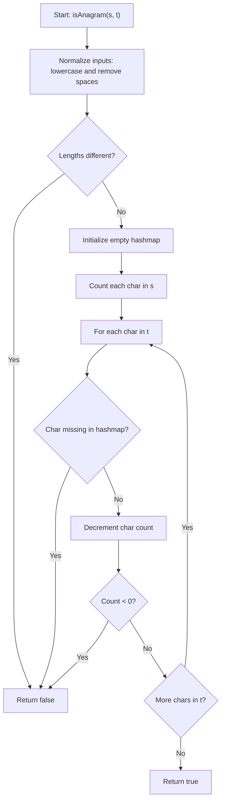

# Valid Anagram Flowchart

flowchart TD
    A([Start: isAnagram(s, t)]) --> B["Normalize inputs: lowercase and remove spaces"]
    B --> C{"Are lengths different?"}
    C -- Yes --> D([Return false])
    C -- No --> E["Initialize hashmap as empty map"]

    E --> F["Loop over each character in s"]
    F --> G["Increment count for that character in hashmap"]

    G --> H["Loop over each character in t"]
    H --> I{"Character not found in hashmap?"}
    I -- Yes --> D
    I -- No --> J["Decrement count for that character"]
    J --> K{"Count becomes negative?"}
    K -- Yes --> D
    K -- No --> L{"More characters in t?"}
    L -- Yes --> H
    L -- No --> M([Return true])
