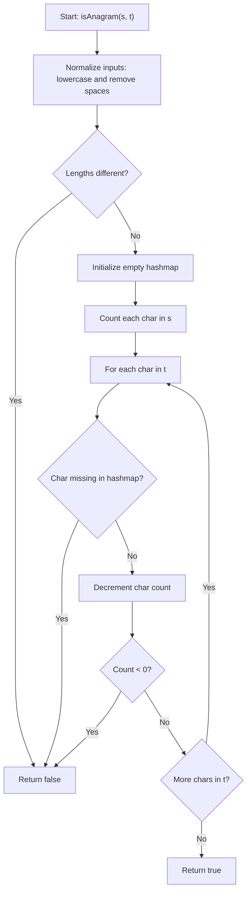

# Valid Anagram Flowchart

```mermaid
graph TD
    A["Start: isAnagram(s, t)"] --> B["Normalize inputs: lowercase and remove spaces"]
    B --> C{"Lengths different?"}
    C -- Yes --> D["Return false"]
    C -- No --> E["Initialize empty hashmap"]
    E --> F["Count each char in s"]
    F --> G["For each char in t"]
    G --> H{"Char missing in hashmap?"}
    H -- Yes --> D
    H -- No --> I["Decrement char count"]
    I --> J{"Count < 0?"}
    J -- Yes --> D
    J -- No --> K{"More chars in t?"}
    K -- Yes --> G
    K -- No --> L["Return true"]
```
