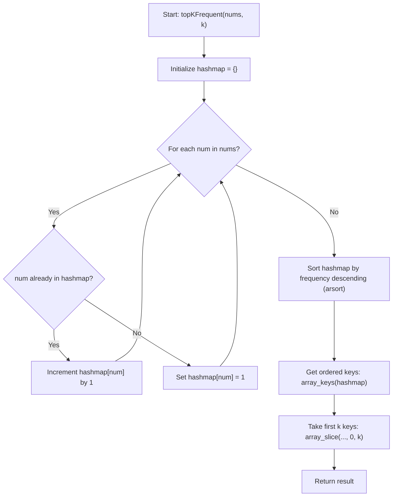
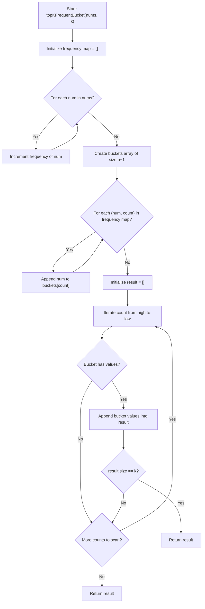

# 0347 Top K Frequent Elements - Flowchart and Complexities

## topKFrequent(nums, k)

- Time complexity: `O(n + m log m + k)`  
  where `n` is the input length and `m` is the number of distinct values.  
  - Counting frequencies: `O(n)`  
  - Sorting frequency map with `arsort`: `O(m log m)`  
  - Slicing first `k` keys: `O(k)`
- Space complexity: `O(m)`  
  for the frequency hashmap and keys list (`m` distinct values).

## topKFrequentBucket(nums, k)

- Time complexity: `O(n)` average  
  where `n` is the number of input elements.  
  - Build frequency map: `O(n)`  
  - Place values into buckets: `O(m)`  
  - Scan buckets and collect top `k`: `O(n)` in the worst case
- Space complexity: `O(n)`  
  (`frequency` map + bucket array + result).
