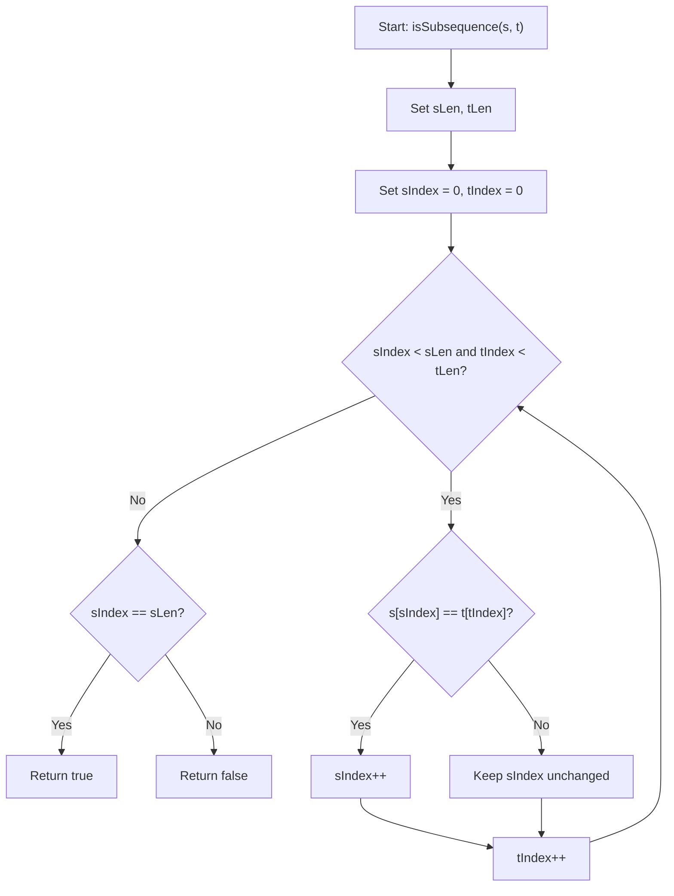
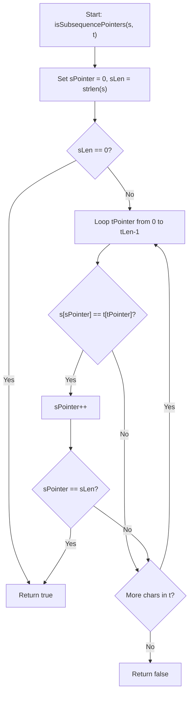

# 0392 Is Subsequence - Flowcharts and Complexities

## isSubsequence(s, t)

- Time complexity: `O(|t|)`  
  In the worst case, we scan through all characters of `t` once.
- Space complexity: `O(1)`  
  Uses only a few index variables.

## isSubsequencePointers(s, t)

- Time complexity: `O(|t|)`  
  Single pass through `t`, with constant work per step.
- Space complexity: `O(1)`  
  Constant extra memory.
